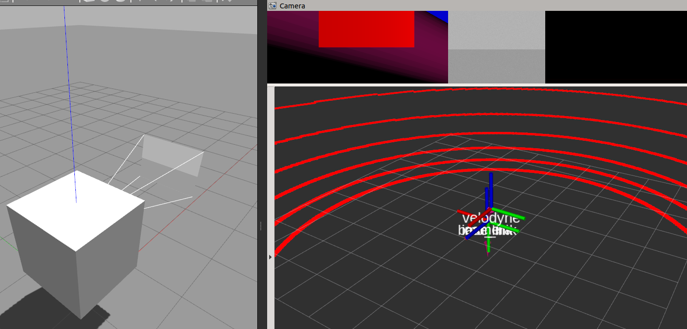

# Platform with 6dof motion

## Intro.

Conducting or evaluating calibration algorithms needs groud-thuth to compared with. However, exactly accurate reference is impossible to obtain. But in simulation scenarios, obtaining ground truth is easy. The repo. get a cubic with sensors move as you like with interact terminal. It moves 6dof to excite or get enough observation.

## Dependancies

* ROS(melodic or noetic are tested)
* Gazebo with proper version to ROS
* (optional) Hector imu gazebo plugin.
* (optional) velodyne gazebo plugin supporting GPU.


## Usage

### 1. build

```bash
mkdir -p catkin_ws/src
cd catkin_ws/src
git clone <this repo.>
cd .. && catkin build
```

### 2. test obj without sensor

```bash
cd catkin_ws
source devel/setup.bash
roslauch obj_with_6dof demo.launch
```

Then you should see interactive terminal to control motion of platform.

```bash
Control Your Vehicle!
    ---------------------------
    Moving around:
        W/S: X-Axis
        A/D: Y-Axis
        X/Z: Z-Axis

        Q/E: Yaw
        I/K: Pitch
        J/L: Roll

    Trans Speed:
    Slow / Fast: 1 / 2

    Rot Speed:
    Slow / Fast: 3 / 4
    
    CTRL-C to quit

pose xyz: [0.0, 0.0, 0.0]
pose rpy: [0.0, 0.0, 0.0]
trans speed: 0.1, rot speed: 0.5
```

### 3. test obj with sensor

```bash
roslaunch obj_with_6dof run.launch
```




### 4. Custom extrinsic

see `urdf/robot.xacro`:

```xml
    <!-- velodyne and its parameters-->
    <xacro:include filename="$(find obj_with_6dof)/urdf/velodyne.xacro"/>
	<xacro:VLP name="rslidar16" topic="lidar_points" organize_cloud="false" hz="10" gpu="true" visualize="false">
        <!-- extrincis to imu -->
		<origin xyz="0.1 0.2 0.5" rpy="0 0 0" />
	</xacro:VLP>

    <!-- camera and its parameters-->
	<xacro:include filename="$(find obj_with_6dof)/urdf/CameraSensor.xacro"/>
	<xacro:Macro_CameraROS name="realsense" parent="base_link" frame="camera_fake" image_topic="image" fov="1.047198" hz="20" width="640" height="480">
        <!-- extrincis to imu -->
		<origin xyz="0.1 0.1 0.1" rpy="0 0 0" />
	</xacro:Macro_CameraROS>
```

If you dont need both of the sensors, just feel free to comment out what you dont need!

### 5. record data

```bash
rosbag record -O <your bag> /imu/data /lidar_points /image
```

### 6. get your ground truth

For example, get lidar frame w.r.t imu frame

```bash
rosrun tf tf_echo /imu_link /velodyne

showing:
At time 0.000
- Translation: [0.100, 0.200, 0.500]
- Rotation: in Quaternion [0.000, 0.000, 0.000, 1.000]
            in RPY (radian) [0.000, -0.000, 0.000]
            in RPY (degree) [0.000, -0.000, 0.000]
```
